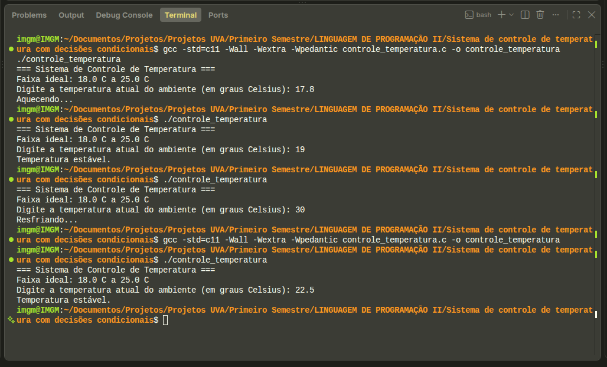

# Sistema de controle de temperatura com decisões condicionais

## 1. Objetivo

O projeto teve como objetivo desenvolver, na linguagem C, um sistema simples de
controle de temperatura. O programa recebe a temperatura atual do ambiente,
compara o valor com uma faixa predefinida e informa a ação que o sistema deve
executar.

## 2. Funcionamento do programa

Foi definida como ideal a faixa entre 18 °C e 25 °C. O comportamento do sistema
é o seguinte:

- temperatura menor que 18 °C: exibe `Aquecendo...`;
- temperatura maior que 25 °C: exibe `Resfriando...`;
- temperatura entre 18 °C e 25 °C, incluindo os limites: exibe
  `Temperatura estável.`.

O código foi dividido em três funções, além da função principal:

- `lerTemperatura()`: lê a temperatura digitada pelo usuário;
- `analisarTemperatura()`: utiliza `if`, `else if` e `else` para decidir qual
  ação deve ser tomada;
- `exibirResultado()`: apresenta ao usuário a mensagem correspondente.

## 3. Testes realizados

| Temperatura informada | Resultado esperado | Resultado obtido |
|---:|---|---|
| 15 °C | Aquecendo... | Aquecendo... |
| 22 °C | Temperatura estável. | Temperatura estável. |
| 30 °C | Resfriando... | Resfriando... |
| 18 °C | Temperatura estável. | Temperatura estável. |
| 25 °C | Temperatura estável. | Temperatura estável. |

## 4. Captura de tela da execução

A captura apresenta a compilação do código e execuções que demonstram as três
ações possíveis do sistema.

## 5. Análise dos resultados

Os testes demonstraram que o sistema se comportou conforme o esperado. Quando a
temperatura ficou abaixo do limite mínimo, o aquecimento foi indicado. Acima do
limite máximo, o resfriamento foi indicado. Nos valores dentro da faixa ideal,
incluindo exatamente 18 °C e 25 °C, o sistema informou que a temperatura estava
estável. A divisão do código em funções tornou o programa mais organizado e
facilitou a compreensão de cada etapa.

## 6. Referências

MANZANO, J. A. N. G. *Algoritmos – Teoria e Prática*. 2. ed. São Paulo: Érica,
2013.

MANZANO, J. A. N. G.; OLIVEIRA, J. F. de. *Estrutura de Dados e Técnicas de
Programação*. 2. ed. São Paulo: Érica, 2018.
